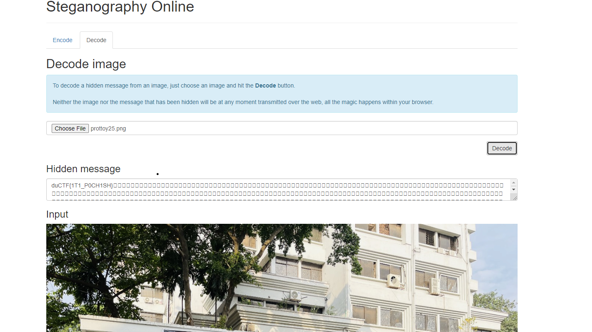

# Prottoy Pochish

## Challenge

[https://en.wikipedia.org/wiki/Steganography](https://en.wikipedia.org/wiki/Steganography)

Files

- [prottoy25.png](./prottoy25.png)

## Solution

The provided link is about Steganography. so we searched for Steganography decoder online.

https://stylesuxx.github.io/steganography/

Using this online tool we got the flag.

